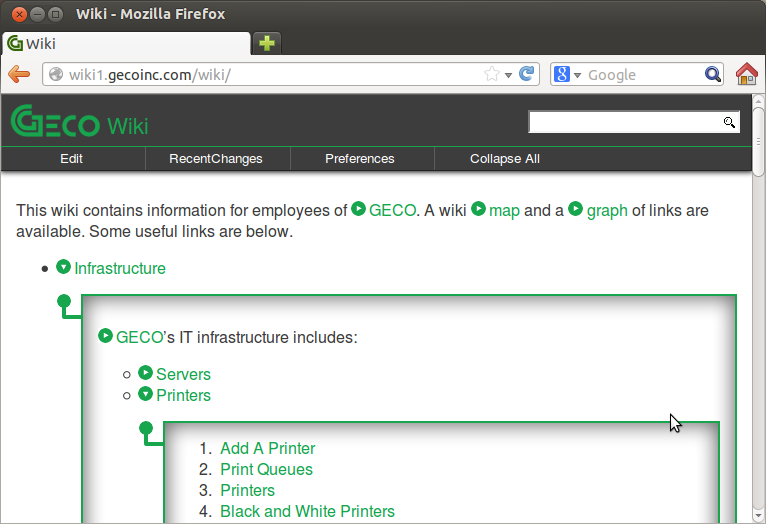

# Inset Pages #

Inset Pages is a simple customization for IkiWiki that adds a toggle arrow next to each WikiLink. When the toggle is clicked, the linked page appears as an inset of the current page. After reading, the inset can be collapsed without ever leaving the original page.



## Installation ##

Edit inset-pages.js and modify the variable `base_path` to point to the path part of your base URL (e.g. if your wiki is at `www.example.com/wiki`, this should be `/wiki`).

Copy all the images and inset-pages.js into a checked out working copy of your wiki at the base level. Optionally do the same for local.css and copy page.tmpl into your templates/ subdirectory. More likely you will want to modify your own local.css and page.tmpl files as described below.

### Add to local.css ###

```css
// This will create a fixed header section that scrolls with your page.
// The javascript collapses the header as you scroll, leaving just the action links
// always available. This is especially useful for having ready access to the "Collapse
// All" link, even when you are at the bottom of a page that has been expanded to great
// length by opening several (possibly nested) insets.
.pageheader {
    box-shadow: 0 0 5px 1px #000;
    position:fixed;
    width:100%;
    top:0;
}

// This creates the style for the inset pages
div.inset {
    margin:15px 0 15px 0;
    padding:0;
    padding-left:25px;
    background-color: #ddd;
    display:block;
    background:url('inset-branch.png');
    background-repeat:no-repeat;
}

div.inset-content {
    border:2px solid #17a54e;
    padding:15px;
    box-shadow: 0 0 20px 2px #666 inset;
    font-size: medium;
    font-weight: normal;
    overflow-x:auto;
}

div.inset-backlinks {
    padding-top:5px;
    padding-left:5px;
    border-top: 1px solid #ccc;
    margin-top:10px;
}

// This adds style to links and images
span.toggle-inset-arrow {
    cursor:pointer;
    margin-right:.2em;
}

img.toggle-inset-arrow-bottom {
    cursor:pointer;
}
```

### Add to page.tmpl ###

```html
<!-- Add these lines to the head section -->
<script type="text/javascript" src="<TMPL_VAR BASEURL>jquery.js"></script>
<script type="text/javascript" src="<TMPL_VAR BASEURL>inset-pages.js"></script>

<!-- Add this line to the ul containing the actions -->
<li><a id="collapse-all">Collapse All</a></li>
```


